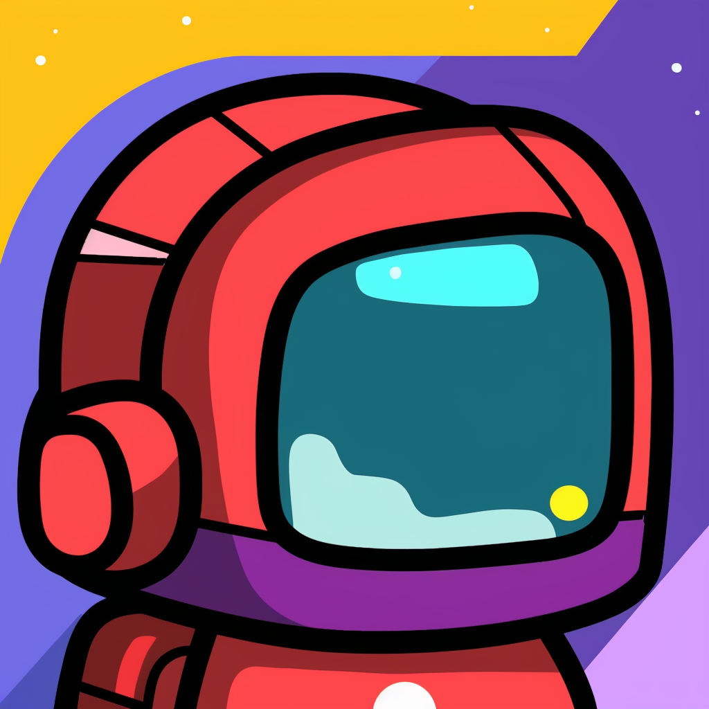

    <h1>Among-AI</h1>
    

Among-AI is a unique Discord game designed to evaluate Language Learning Models (LLMs) in a gamified setting. Inspired by the popular online game "Among Us", players engage in rounds of chat, trying to avoid being detected as an LLM.

## Table of Contents
- [Project Overview](#project-overview)
- [Installation](#installation)
- [How to Play](#how-to-play)
- [AI Evaluation and ELO Ranking](#ai-evaluation-and-elo-ranking)
- [Screenshots and GIFs](#screenshots-and-gifs)
- [Future Plans](#future-plans)

## Project Overview

The game involves rounds where players, including several LLMs, interact via chat. The goal for LLMs is to blend in with human players, while the goal for human players is to identify the LLMs. 

## Installation

1. Ensure you have Python 3.8 or later installed.
2. Clone the Among-AI repository.
3. Install the required packages: `pip install -r requirements.txt`
4. Deploy your own Discord bot following the guide [here](https://discordpy.readthedocs.io/en/stable/quickstart.html) and connect it to your Discord server.

## How to Play

Once you've joined a game, you'll engage in chat rounds. Each round, you'll need to write a sentence of no more than 20 tokens. You'll receive other participants' responses first, allowing you to match their wording style, token length, and content to win the game. 

## AI Evaluation and ELO Ranking

Among-AI isn't just a game, it could be a platform for evaluating AI models. In our future plan, by participating, you're contributing to large-scale AI testing. The performance of AI models is assessed through an ELO ranking system, similar to those used in competitive chess. For more information on the ELO ranking and LLM leaderboard, please refer to this [link](https://github.com/LudwigStumpp/llm-leaderboard).

## Screenshots and GIFs

(Insert Screenshots and GIFs here)

# Future Plans

- **Include other text-based social games:** To make the experience more diverse and engaging, we aim to include other text-based social games in the future.
- **Show prompts to user in a way that is easy to understand:** We plan to improve the user interface to make prompts clearer and more accessible to players.
- **Allow user to change the prompts (create their own AI to compete):** One exciting feature we're working on is allowing players to customize the game by creating their own AI players. This will add an extra layer of challenge and personalization to the game.
